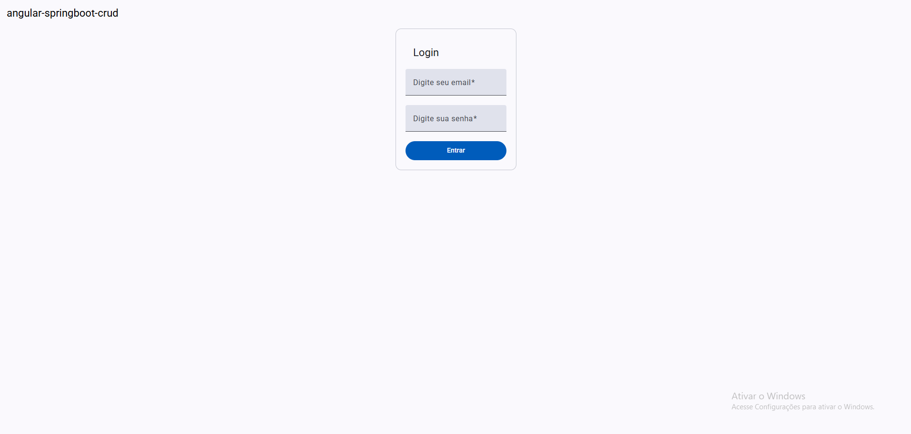
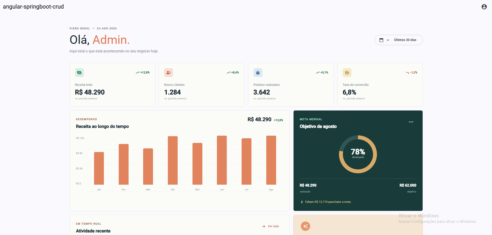

# Projeto Full Stack - Angular + Spring Boot

Sistema full stack desenvolvido com **Angular** no frontend e **Spring Boot** no backend.  
A aplicação possui autenticação de usuários com **JWT**, fluxo de **login e registro**, integração com banco de dados **MySQL** e acesso a um **dashboard protegido**.

---

# Preview

## Tela de Login


## Dashboard


---

# Tecnologias Utilizadas

## Frontend (`client`)

- Angular Standalone Components
- Angular Material
- TypeScript
- RxJS

## Backend (`server`)

- Java
- Spring Boot
- Spring Security
- Spring Data JPA
- Hibernate
- JWT Authentication
- PostgreSQL
- Maven
- JUnit
- Mockito

---

# Funcionalidades

- Registro de usuários
- Login autenticado com JWT
- Token JWT expirável
- Senhas armazenadas com BCrypt
- CRUD de usuários
- Listagem de usuários com paginação
- Busca de usuário por ID
- Atualização de usuário
- Soft delete de usuários
- Busca dos dados do usuário autenticado
- Rotas protegidas com Bearer Token
- Validação de dados
- Tratamento global de exceções
- Persistência de dados com PostgreSQL
- Testes unitários básicos da camada de serviços
- Angular utilizando arquitetura Standalone Components

---

# Banco de Dados

O projeto utiliza:

- PostgreSQL
- Spring Data JPA
- Hibernate

Configure as variáveis de ambiente no arquivo:

```bash
server\src\main\resources\application.properties
```

Exemplo:

```env
spring.application.name=server
server.port=8080

# PostgreSQL
spring.datasource.url=jdbc:postgresql://localhost:5432/db_springboot_crud
spring.datasource.username=postgres
spring.datasource.password=password
spring.datasource.driver-class-name=org.postgresql.Driver

# JPA/Hibernate
spring.jpa.hibernate.ddl-auto=validate
spring.jpa.database-platform=org.hibernate.dialect.PostgreSQLDialect
```

# Autenticação JWT

A autenticação foi implementada utilizando:

- Access Token JWT
- Expiração do token
- Spring Security
- AuthenticationManager
- UserDetailsService
- PasswordEncoder
- Bearer Token
- Rotas protegidas

---

# Arquitetura Frontend

O frontend foi desenvolvido utilizando o **Angular Standalone Components**, uma abordagem moderna do Angular que elimina a necessidade de módulos tradicionais (`NgModules`), deixando a aplicação mais simples, escalável e performática.

Principais vantagens:

- Melhor organização de componentes
- Estrutura mais moderna
- Menos boilerplate
- Carregamento otimizado
- Melhor experiência de desenvolvimento

# Principais Conceitos Aplicados

- Arquitetura Full Stack
- API REST
- CRUD
- Autenticação Stateless
- JWT Authentication
- Bearer Token
- Spring Security
- AuthenticationManager
- UserDetailsService
- Password Encoding
- Spring Data JPA
- Hibernate
- ORM
- DTOs
- Validação de dados
- Tratamento global de exceções
- Paginação
- Soft Delete
- Testes unitários
- Integração Frontend + Backend
- Angular Standalone Components

